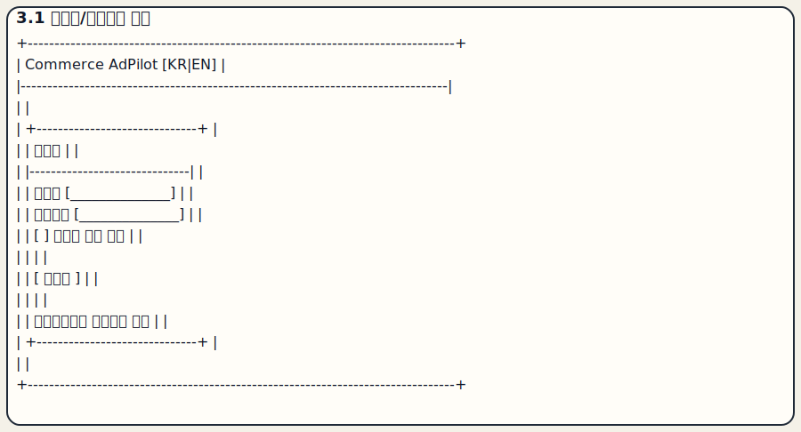
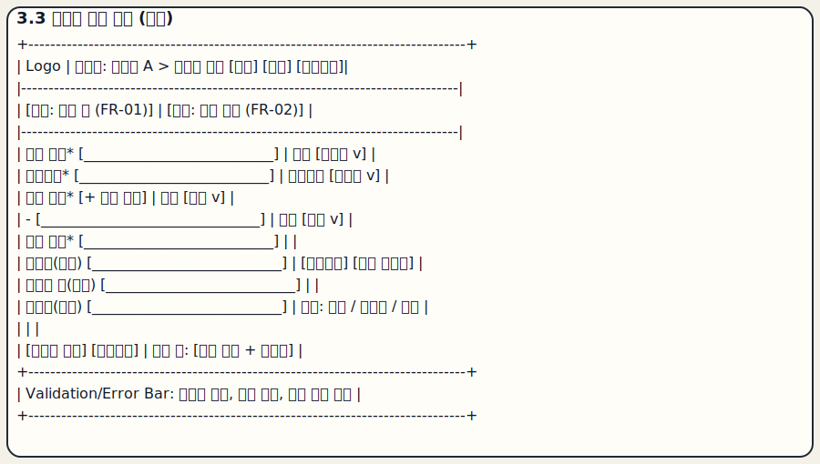
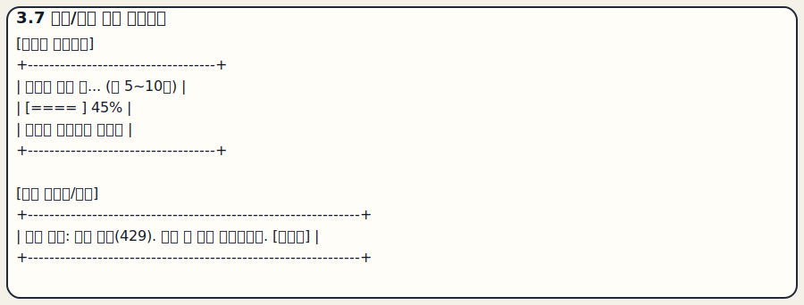
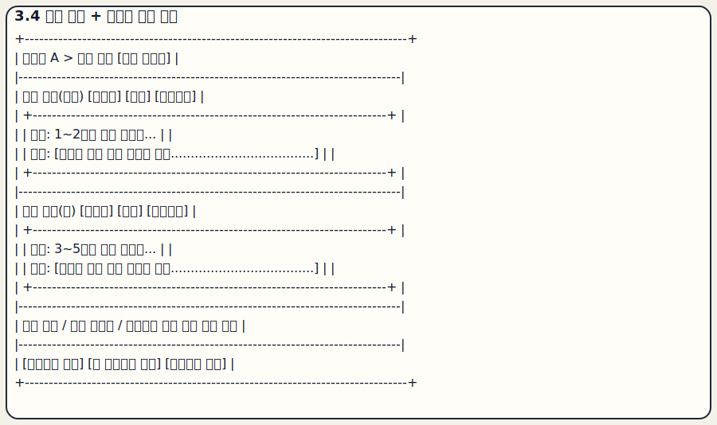
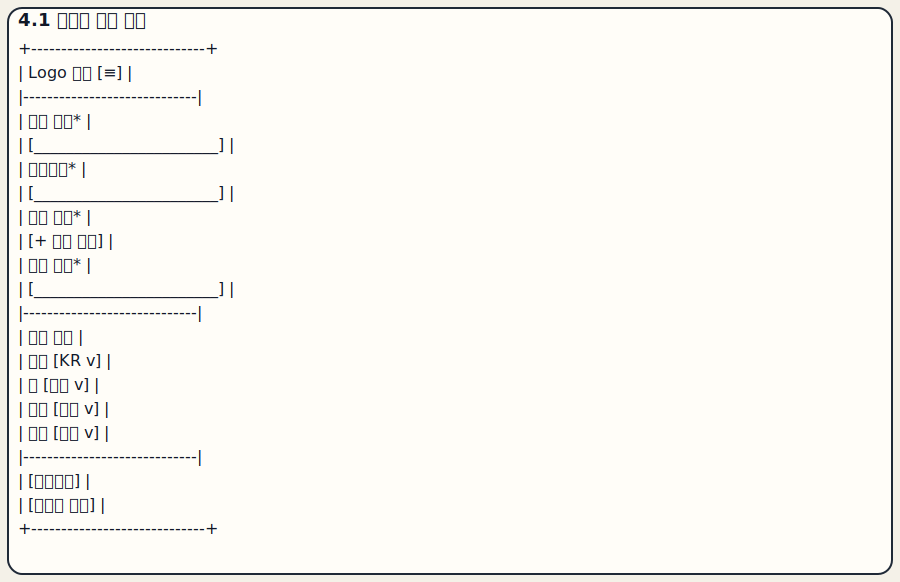
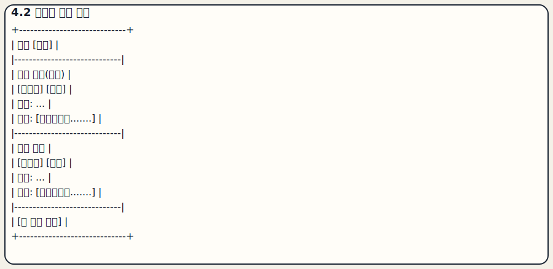
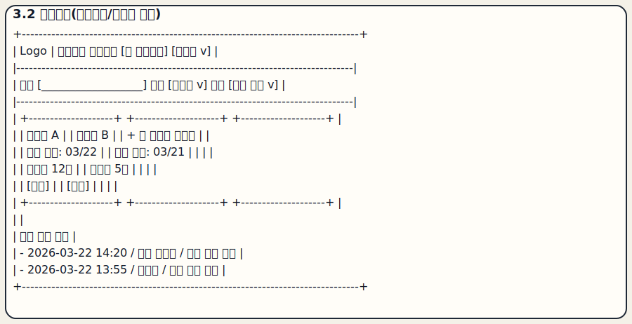
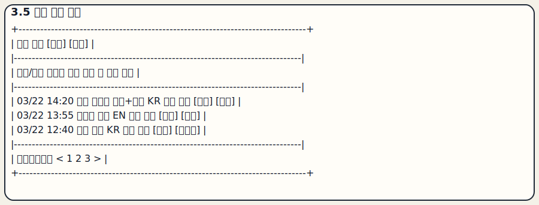
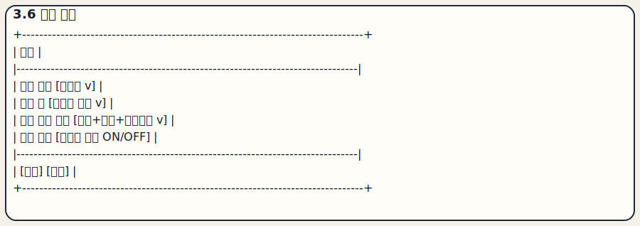

# Commerce AdPilot Wireframe Gallery (SVG)

아래 이미지는 docs/ui-wireframe.md 기준 와이어프레임을 SVG로 정리한 갤러리입니다.
현재 SVG 파일은 일부가 이전 버전에서 생성되어, 섹션명 기준으로 매핑해 두었습니다.

중간 충실도로 다듬은 화면 프리뷰: [ui-polished-preview.html](ui-polished-preview.html)

## 4.1 즉시 진입 화면 (로그인 없음)

## 4.2 생성 워크스페이스 (핵심)

## 4.3 생성 진행/부분 실패 상태

## 4.4 결과 검토/편집 화면

## 4.5 내보내기 모달

내보내기 모달은 현재 전용 SVG가 없어 다음 변환 배치에서 추가 예정입니다.

## 5.1 모바일 생성 화면

## 5.2 모바일 결과 화면

## 참고: 레거시 SVG (아카이브)

- 대시보드(구버전): 
- 생성 이력(구버전): 
- 설정(구버전): 

